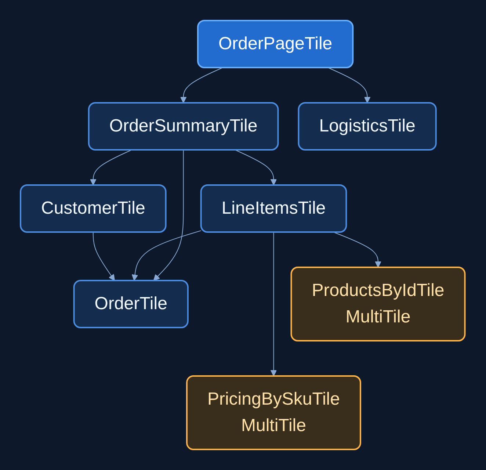

<picture>
  <source media="(prefers-color-scheme: dark)" srcset="./.github/images/mosaic-logo-dark.png">
  <source media="(prefers-color-scheme: light)" srcset="./.github/images/mosaic-logo-light.png">
  
</picture>

[](https://github.com/Nick-Abbott/Mosaic/actions?query=workflow%3A%22Test+Badge%22)
[](https://github.com/Nick-Abbott/Mosaic/actions?query=workflow%3A%22Build+Badge%22)
[](https://kotlinlang.org)
[](LICENSE)

**Think from the response up, not the database down.**

Mosaic is a Kotlin library for building backends one response at a time. A **Tile** is a
reusable suspend computation that reads the data it needs and composes other
Tiles. Callers ask for its result; Mosaic shares the work within each request.

## 🚀 **Why Mosaic?**

- **🎯 Response first** — Start with what your endpoint returns.
- **🧩 Self-contained Tiles** — Each piece knows how to get what it needs.
- **⚡ Shared work** — Independent branches can reuse the same result.
- **🗺️ Architecture you can see** — Turn composition code into dependency diagrams.

## 🎯 **Start with the Response**

An order page needs a summary and shipping details. That's also how you write it:

```kotlin
val OrderPageTile = singleTile {
  val summary = composeAsync(OrderSummaryTile)
  val logistics = composeAsync(LogisticsTile)

  OrderPage(summary.await(), logistics.await())
}
```

`composeAsync` starts the work; `await` gets the result. Both branches can run
concurrently. Use `compose` when you need a result before continuing.

The endpoint stays small even when the data behind it doesn't. The summary Tile
builds its own part of the response:

```kotlin
val OrderSummaryTile = singleTile {
  val order = composeAsync(OrderTile)
  val customer = composeAsync(CustomerTile)
  val lineItems = composeAsync(LineItemsTile)

  OrderSummary(order.await(), customer.await(), lineItems.await())
}
```

`LineItemsTile` goes deeper, fetching products and prices. None of that wiring
spills into the page Tile. [Follow the complete order example](examples/tile-library/src/main/kotlin/org/buildmosaic/library)
or see [how the composition works](mosaic-core/README.md#-composition).

## ⚡ **Ask Twice. Share the Work.**

The page needs line items. So does the order total:

```kotlin
val OrderTotalTile = singleTile {
  compose(LineItemsTile).sumOf { it.price.amount * it.quantity }
}

// In a suspending handler, using the same request Mosaic:
val page = mosaic.composeAsync(OrderPageTile)
val total = mosaic.composeAsync(OrderTotalTile)
println("${page.await().summary.order.id}: ${total.await()}")
```

Both branches reach `LineItemsTile`, but it runs once in this Mosaic. They share
its in-flight work and result without coordinating with each other.
Reuse is scoped to the **same Mosaic and Tile instance**; a new Mosaic starts
fresh. [More on caching and identity →](mosaic-core/README.md#-caching-and-identity)

## 🔧 **Fetch by Key with MultiTile**

Have a bulk API? Put it behind a MultiTile:

```kotlin
val ProductsByIdTile = multiTile<String, Product> { ids ->
  ProductService.getProducts(ids.toList())
}

// In the same request Mosaic:
val first = mosaic.compose(ProductsByIdTile, listOf("product-1"))
val next = mosaic.compose(ProductsByIdTile, listOf("product-1", "product-2"))
// The second call only fetches product-2.
```

The same MultiTile and equal keys share work within a Mosaic. Choose `perKeyTile`
for individual fetches or `chunkedMultiTile` for smaller batches; callers keep the
same API. Separate calls aren't guaranteed to merge into one backend batch.

[Choose a batching strategy →](mosaic-core/README.md#-multitile)

## 🏁 **Try It**

Add Mosaic to a Kotlin/JVM project:

```kotlin
dependencies {
  implementation("org.buildmosaic:mosaic-core:0.4.0")
  testImplementation("org.buildmosaic:mosaic-test:0.4.0")
  testImplementation(kotlin("test"))
}
```

No registration plugin or processor is needed. The optional
[BOM](mosaic-bom/README.md) aligns the runtime library versions.

A **Canvas** holds application services and request data. A **Mosaic** runs Tiles
and keeps their results. A Tile can read an input and call an ordinary service:

```kotlin
val OrderKey = CanvasKey(String::class, "orderKey")
val OrderTile = singleTile {
  OrderService.getOrder(source(OrderKey))
}
```

Bind that input at the request boundary, then ask for the page:

```kotlin
suspend fun orderPage(applicationCanvas: Canvas, orderId: String): OrderPage =
  applicationCanvas.withLayer {
    single(OrderKey) { orderId }
  }.use { requestCanvas ->
    requestCanvas.create().compose(OrderPageTile)
  }
```

Here `use` closes the request Canvas. The [complete quick start](mosaic-core/README.md#-quick-start)
covers application setup, resource ownership, and runtime requirements.

## 🗺️ **Your Code, Your Architecture**

Your Tile graph is already an architecture model. The optional analysis plugin
can turn it into documentation—there's no separate graph to keep in sync by hand.

```bash
./gradlew mosaicGraph
```



*Tile-only excerpt rendered from the generated order graph. Labels are shortened
and composition steps collapsed; only the summary branch is expanded.*

Open `build/reports/mosaic-analysis/graph.md` for the full Markdown and Mermaid
graph, including what each Tile needs from Canvas and where it's bound. The plugin
can discover application entry points when safe and follow Tile dependencies
across modules.

It checks Canvas bindings and distinguishes **confirmed missing dependencies**
from paths it can't verify. This optional tooling supports **Kotlin/JVM 2.2.10
only**; runtime composition doesn't depend on it. The graph shows static
relationships, not runtime traces.

[Set up architecture reports and verification →](mosaic-gradle-plugin/README.md)

## 🧪 **Test the Composition, Skip the Services**

Tests can swap out dependency Tiles while leaving the page's composition untouched:

```kotlin
@Test
fun `order page combines summary and logistics`() = runTest {
  val testMosaic = mosaicBuilder()
    .withMockTile(OrderSummaryTile, mockSummary)
    .withMockTile(LogisticsTile, mockLogistics)
    .build()

  testMosaic.assertEquals(OrderPageTile, OrderPage(mockSummary, mockLogistics))
}
```

`mockSummary` and `mockLogistics` are fixture values; the real `OrderPageTile` puts
them together. The [testing guide](mosaic-test/README.md) covers setup, Canvas
inputs, failures, and delays simulated with coroutine virtual time.

## 📈 **Measured Against Handwritten Kotlin**

Mosaic has a cost. Paired application benchmarks compare it with equivalent
optimized Kotlin doing the same downstream work:

| Workload | Additional Mosaic CPU/request |
| --- | ---: |
| Light and batching | **11–31 µs** |
| Complex aggregate graph | **48–101 µs** |
| CPU-heavy | **1–12 µs** |

In the service-backed aggregate case, Mosaic added about **101 µs of CPU/request**.
Median HTTP latency was **21.44 ms direct vs 21.45 ms Mosaic**—a difference below
the benchmark's approximately 1 ms timing accuracy.

Absolute timings depend on hardware and JVM; each direct/Mosaic pair ran under
identical conditions. [Results, workloads, and methodology →](performance/README.md)

## 🌐 **Bring Your HTTP Framework**

The same order Tiles run behind three example applications:

- **[Spring Boot](examples/spring-example)** — Controllers and application Canvas configuration
- **[Ktor](examples/ktor-example)** — Coroutine route handlers
- **[Micronaut](examples/micronaut-example)** — Controllers and dependency injection

[Run an example →](mosaic-core/README.md#-framework-integration)

## 📄 **License**

Licensed under [Apache 2.0](LICENSE). See the [Changelog](CHANGELOG.md) for release history.

Copyright 2025 Nicholas Abbott
