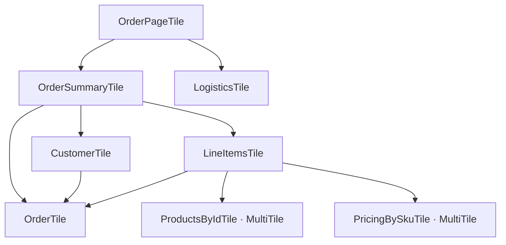
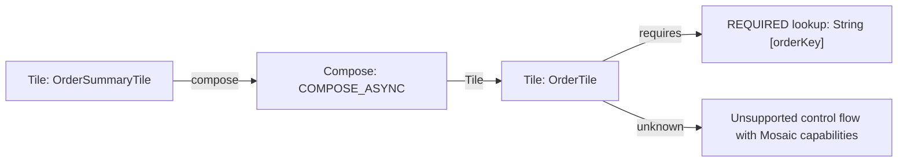

<picture>
  <source media="(prefers-color-scheme: dark)" srcset="./.github/images/mosaic-logo-dark.png">
  <source media="(prefers-color-scheme: light)" srcset="./.github/images/mosaic-logo-light.png">
  
</picture>

[](https://github.com/Nick-Abbott/Mosaic/actions?query=workflow%3A%22Test+Badge%22)
[](https://github.com/Nick-Abbott/Mosaic/actions?query=workflow%3A%22Build+Badge%22)
[](https://kotlinlang.org)
[](LICENSE)

**Think from the response up, not the database down.**

Mosaic is a Kotlin framework for backend orchestration through **composable tiles**. Build responses from small pieces that retrieve their own dependencies, share results within a Mosaic, and overlap independent work with coroutines.

## 🚀 **Why Mosaic?**

- **📦 Response-First Design**: Start with the response and compose the data it needs
- **🧩 Typed Composition**: Kotlin types connect tile inputs, dependencies, and results
- **⚡ Shared Work**: Reuse the same Tile result or MultiTile key within one Mosaic
- **🔄 Explicit Concurrency**: Start independent work with `composeAsync`, then await it
- **🧪 Natural Testability**: Mock dependency tiles to test response logic in isolation
- **🗺️ Architecture Tooling**: Generate dependency diagrams and check Canvas contracts with optional analysis

## 🏁 **Get Started**

Add Mosaic to an existing Kotlin/JVM project:

```kotlin
dependencies {
  implementation("org.buildmosaic:mosaic-core:0.4.0")
  testImplementation("org.buildmosaic:mosaic-test:0.4.0")
  testImplementation(kotlin("test"))
}
```

Mosaic uses ordinary library dependencies; Tile registration plugins and processors
are not required. The optional [BOM](mosaic-bom/README.md) aligns the runtime
libraries so you can omit their individual versions.

Here is a complete first request, using a small in-memory service:

```kotlin
import org.buildmosaic.core.*
import org.buildmosaic.core.injection.*

data class Customer(val id: String, val name: String)
class CustomerService {
  fun getCustomer(id: String) = Customer(id, "Jane")
}

val CustomerIdKey = CanvasKey(String::class, "customerId")
val CustomerTile = singleTile {
  source<CustomerService>().getCustomer(source(CustomerIdKey))
}

suspend fun main() {
  canvas { single<CustomerService> { CustomerService() } }.use { applicationCanvas ->
    applicationCanvas.withLayer {
      single(CustomerIdKey) { "customer-1" }
    }.use { requestCanvas ->
      val mosaic = requestCanvas.create()
      val customer = mosaic.compose(CustomerTile)
      println(customer.name) // Jane
    }
  }
}
```

Canvas holds application services; a request layer adds input without passing it
through every Tile. A Mosaic executes those Tiles and holds their shared results.
Here `use` explicitly closes each concrete `MosaicCanvas`. Typed lookups do not
prove that every required binding exists.

The [core quick start](mosaic-core/README.md#-quick-start) covers runtime requirements
and first use; the [Canvas guide](mosaic-core/README.md#-dependencies-with-canvas)
explains providers, keys, layering, and resource ownership.

## 🎯 **Response-First Design**

Start with what an endpoint returns. Each Tile composes the pieces it needs;
callers ask for a value without passing its dependencies down the graph:

```kotlin
val OrderPageTile = singleTile {
  val summary = composeAsync(OrderSummaryTile)
  val logistics = composeAsync(LogisticsTile)

  OrderPage(summary.await(), logistics.await())
}

val OrderSummaryTile = singleTile {
  val order = composeAsync(OrderTile)
  val customer = composeAsync(CustomerTile)
  val lineItems = composeAsync(LineItemsTile)

  OrderSummary(order.await(), customer.await(), lineItems.await())
}
```

This excerpt uses the models and dependency tiles in the
[runnable order examples](examples/tile-library/src/main/kotlin/org/buildmosaic/library).
Their summary branch reaches several levels deep:



This compact view shows composition relationships, with the logistics branch
collapsed. Each Tile owns its part of the graph. Start independent work with
`composeAsync` before awaiting results; sequential `compose` calls remain
sequential. The [core composition guide](mosaic-core/README.md#-composition)
shows the product and pricing lookups behind `LineItemsTile`.

## ⚡ **Share Work Across the Response**

`OrderSummaryTile`, `CustomerTile`, and `LineItemsTile` each compose `OrderTile`
independently. Within the same Mosaic, those branches share its in-flight work
and cached result. The caller does not coordinate that reuse:

```kotlin
// In a suspending handler, using one request Mosaic and the example tiles:
val page = mosaic.composeAsync(OrderPageTile)
val total = mosaic.composeAsync(OrderTotalTile)
// Both paths reach the same LineItemsTile and OrderTile instances.
println("${page.await().summary.order.id}: ${total.await()}")
```

Deduplication uses the same Tile instance, or the same MultiTile instance and
equal key. Keep reusable tiles in `val`s and create a Mosaic per request. A new
Mosaic starts with a fresh cache, even when it uses the same Canvas. See
[caching and identity](mosaic-core/README.md#-caching-and-identity) for details.

## 🔧 **Batch Operations with MultiTile**

A MultiTile puts the bulk-fetch strategy behind the same small composition API.
Using the order example's `ProductService` and `Product` model:

```kotlin
val ProductsByIdTile = multiTile<String, Product> { ids ->
  ProductService.getProducts(ids.toList())
}

val OrderProductsTile = singleTile {
  val order = compose(OrderTile)
  compose(ProductsByIdTile, order.items.map { it.productId }) // Map<String, Product>
}
```

Within one request Mosaic, repeated equal keys for the same MultiTile share work;
only uncached keys reach the fetcher. Separate calls are not guaranteed to merge
into one batch. Swap in `perKeyTile` for individual fetches or `chunkedMultiTile`
for bounded batch sizes without changing consumers or asking them to coordinate
the fetch strategy.

For async batches, `composeAsync(tile, keys)` returns `Map<K, Deferred<V>>`:
await each entry you need. See [MultiTile return shapes and strategies](mosaic-core/README.md#-multitile).

## 🗺️ **See and Verify Your Architecture**

Your composition model can also become architecture documentation. With the
optional analysis plugin installed in a supported project, run:

```bash
./gradlew mosaicGraph
```

It writes **`build/reports/mosaic-analysis/graph.md`**: Markdown with Mermaid
diagrams of Tiles, MultiTiles, composition relationships, Canvas bindings and
requirements, and relevant selected dependency contracts.

Here is a small excerpt from a report generated from the order example's sources
(labels shortened). It connects composition to a Canvas requirement and makes an
unresolved boundary visible:



The full report includes application-root views, findings, and uncertainty; the
order example has unverifiable paths, not a blanket verification pass. These are
static relationships, not runtime ordering, call counts, latency, or exact batch
sizes.

The optional analyzer can **discover application roots automatically when safe**,
follow selected local and dependency contracts, and detect **proven missing
Canvas bindings**. Unverifiable paths remain visible: `STANDARD` warns, while
`STRICT` also fails them during verification. Root-specific findings feed the
graph report, so a diagram can help locate a missing requirement or an unknown
boundary.

Runtime composition does not depend on this tooling. Analysis has conservative
boundaries and currently supports **Kotlin/JVM 2.2.10 only**. See the
[analysis Gradle plugin guide](mosaic-gradle-plugin/README.md) for installation,
root selection, enforcement, and limitations.

## 🧪 **Test Response Logic in Isolation**

Replace dependency tiles while exercising the real composition. For example,
using the order example's `OrderPageTile` and fixture values:

```kotlin
@Test
fun `order page combines summary and logistics`() = runTest {
  val testMosaic = mosaicBuilder()
    .withMockTile(OrderSummaryTile, mockSummary)
    .withMockTile(LogisticsTile, mockLogistics)
    .build()

  testMosaic.assertEquals(OrderPageTile, OrderPage(mockSummary, mockLogistics))
}
```

The [testing guide](mosaic-test/README.md) has a complete first test, Canvas input
setup, failure assertions, and simulated delays using coroutine virtual time.

## 📈 **Performance**

Mosaic is measured against equivalent optimized handwritten Kotlin, using paired
application runs with the same logical downstream work. The measured additional
CPU cost was **11–31 µs/request** for light and batching workloads, **48–101 µs/request** for a complex aggregate graph, and **1–12 µs/request** for the CPU-heavy workload.
In the service-backed aggregate benchmark, Mosaic added about **101 µs of CPU per request**, while median HTTP latency was 21.44 ms for direct Kotlin and 21.45 ms for Mosaic—a difference below the benchmark's approximately 1 ms timing accuracy.
Absolute timings depend on hardware and JVM; the published results are paired
direct/Mosaic comparisons under identical conditions.
See [application results and methodology](performance/README.md) for workload
scope and measurement limits.

## 🌐 **Framework Integration**

Use Mosaic behind your existing HTTP framework. Runnable applications share the
same order tiles:

- **[Spring Boot](examples/spring-example)**: Controllers and application Canvas configuration
- **[Ktor](examples/ktor-example)**: Coroutine route handlers
- **[Micronaut](examples/micronaut-example)**: Controllers and dependency injection

See the [core guide](mosaic-core/README.md#-framework-integration) for commands to
run them.

## 📄 **License**

This project is licensed under the Apache License 2.0 - see the [LICENSE](LICENSE) file for details.
See the [Changelog](CHANGELOG.md) for user-facing release history.

Copyright 2025 Nicholas Abbott
