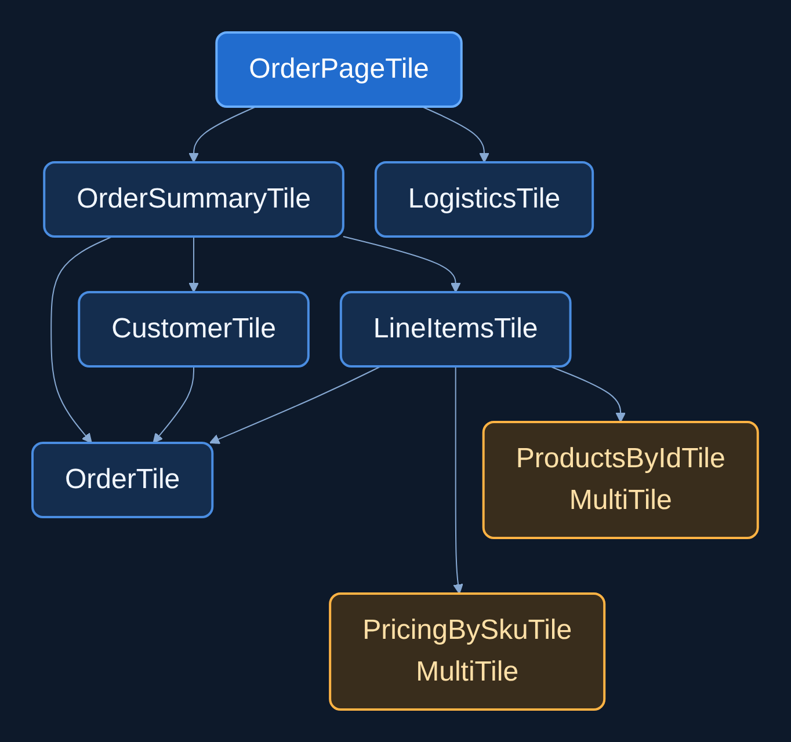

<picture>
  <source media="(prefers-color-scheme: dark)" srcset="./.github/images/mosaic-logo-dark.svg" type="image/svg+xml">
  <source media="(prefers-color-scheme: dark)" srcset="./.github/images/mosaic-logo-dark.png" type="image/png">
  <source media="(prefers-color-scheme: light)" srcset="./.github/images/mosaic-logo-light.svg" type="image/svg+xml">
  
</picture>

[](https://github.com/BuildMosaic/Mosaic/actions?query=workflow%3A%22Test+Badge%22)
[](https://github.com/BuildMosaic/Mosaic/actions?query=workflow%3A%22Build+Badge%22)
[](https://kotlinlang.org)
[](LICENSE)

**Think from the response up, not the database down.**

**[Get started at BuildMosaic.org](https://BuildMosaic.org/start/quick-start/) · [Documentation](https://BuildMosaic.org/start/overview/) · [Kotlin API](https://BuildMosaic.org/api/)**

Mosaic is a Kotlin library for building backends one response at a time. A **Tile** is a
reusable piece of work that can read request or application data and compose other
Tiles. A request-scoped Mosaic shares repeated Tile work automatically.

The public stable release is **[0.6.0](https://github.com/BuildMosaic/Mosaic/releases/tag/0.6.0)**.
For released examples, use the [0.6.0 README](https://github.com/BuildMosaic/Mosaic/blob/0.6.0/README.md);
`develop` includes unreleased APIs and examples.

## 🚀 **Why Mosaic?**

- **🎯 Response first** — Start with what your endpoint returns.
- **🧩 Self-contained Tiles** — Each piece knows how to get what it needs.
- **⚡ Shared work** — Independent branches can reuse the same result.
- **🗺️ Architecture you can see** — Turn composition code into dependency diagrams.

## 🎯 **Start with the Response**

An order page needs a summary and shipping details. That's also how you write it:

```kotlin
val OrderPageTile by singleTile {
  val summary = composeAsync(OrderSummaryTile)
  val logistics = composeAsync(LogisticsTile)

  OrderPage(summary.await(), logistics.await())
}
```

`composeAsync` starts the work; `await` gets the result. Both branches can run
concurrently. Use `compose` when you need a result before continuing.

The endpoint stays small even when the data behind it doesn't. The summary Tile
builds its own part of the response:

```kotlin
val OrderSummaryTile by singleTile {
  val order = composeAsync(OrderTile)
  val customer = composeAsync(CustomerTile)
  val lineItems = composeAsync(LineItemsTile)

  OrderSummary(order.await(), customer.await(), lineItems.await())
}
```

`LineItemsTile` goes deeper, fetching products and prices. None of that wiring
spills into the page Tile. [Follow the complete order example](examples/tile-library/src/main/kotlin/org/buildmosaic/library)
or see [how the composition works](https://BuildMosaic.org/concepts/tiles/).

## ⚡ **Ask Twice. Share the Work.**

The page needs line items. So does the order total:

```kotlin
val OrderTotalTile by singleTile {
  compose(LineItemsTile).sumOf { it.price.amount * it.quantity }
}

// In a suspending handler, using the same request Mosaic:
val page = mosaic.composeAsync(OrderPageTile)
val total = mosaic.composeAsync(OrderTotalTile)
println("${page.await().summary.order.id}: ${total.await()}")
```

Both branches reach `LineItemsTile`, but it runs once in this Mosaic. They share
its in-flight work and result without coordinating with each other.
Reuse is scoped to the **same Mosaic and Tile instance**; a new Mosaic starts
fresh. [More on caching and identity →](https://BuildMosaic.org/concepts/shared-work/)

## 🔧 **Fetch by Key with MultiTile**

Have a bulk API? Put it behind a MultiTile:

```kotlin
val ProductsByIdTile by multiTile<String, Product> { ids ->
  source<ProductService>().getProducts(ids.toList())
}

// In the same request Mosaic:
val first = mosaic.compose(ProductsByIdTile, listOf("product-1"))
val next = mosaic.compose(ProductsByIdTile, listOf("product-1", "product-2"))
// The second call only fetches product-2.
```

The same MultiTile and equal keys share work within a Mosaic. When new keys from
several calls are pending before execution begins, Mosaic can combine them into
one invocation. It does not intentionally wait for more keys, so exact batch
boundaries depend on scheduling. Choose `perKeyTile` for individual fetches or
`chunkedMultiTile` for smaller batches; callers keep the same API.

[Choose a batching strategy →](https://BuildMosaic.org/concepts/batching/)

## 🏁 **Try It**

Add Mosaic to a Kotlin/JVM project:

```kotlin
dependencies {
  implementation("org.buildmosaic:mosaic-core:0.6.0")
}
```

No registration plugin or processor is needed. The optional
[BOM](mosaic-bom/README.md) aligns the runtime library versions.

A **Canvas** holds application services and request data. A **Mosaic** runs Tiles
and keeps their results. A Tile can read an input and call an ordinary service:

```kotlin
val OrderKey = CanvasKey(String::class, "orderKey")
val OrderTile by singleTile {
  source<OrderService>().getOrder(source(OrderKey))
}
```

The application creates the services and registers its existing instances with
Canvas. `instance` borrows them; the application retains ownership:

```kotlin
val applicationCanvas = canvas {
  instance(orderService)
  instance(customerService)
  instance(productService)
  instance(pricingService)
  instance(addressService)
  instance(carrierService)
}
```

The [framework examples](examples) show how each application creates these services.
Bind the request input in a child Canvas, then ask for the page:

```kotlin
suspend fun orderPage(applicationCanvas: Canvas, orderId: String): OrderPage =
  applicationCanvas.withLayer {
    instance(key = OrderKey, value = orderId)
  }.withMosaic { compose(OrderPageTile) }
```

Import `org.buildmosaic.core.injection.withMosaic`. The calling coroutine owns Tile work;
leaving the block cancels unfinished work and waits for cleanup.

The [complete quick start](https://BuildMosaic.org/start/quick-start/)
covers application setup, resource ownership, and runtime requirements.

## 🗺️ **Your Code, Your Architecture**

Your Tile graph is already an architecture model. The optional analysis plugin
can turn it into documentation—there's no separate graph to keep in sync by hand.

```bash
./gradlew mosaicGraph
```



*Order architecture derived from `mosaicGraph` output.*

Open `build/reports/mosaic-analysis/graph.md` for the full Markdown and Mermaid
graph, including what each Tile needs from Canvas and where it's bound. The plugin
can discover application entry points when safe and follow Tile dependencies
across modules.

It checks Canvas bindings and distinguishes **confirmed missing dependencies**
from paths it can't verify. Analysis supports **Kotlin/JVM 2.4.20 only**. Runtime composition
doesn't depend on it. The graph shows static relationships, not runtime traces.

[Set up architecture reports and verification →](https://BuildMosaic.org/guides/analysis/)

## 🔍 **See the Work That Ran**

Add Mosaic execution to your existing OpenTelemetry traces:

```kotlin
val applicationCanvas = canvas {
  tracing { openTelemetry }
}
```

The optional adapter creates one span per SingleTile execution or MultiTile batch,
using property names captured by delegated declarations such as
`val OrderTile by singleTile { ... }`. Unnamed Tiles use `Mosaic single` or `Mosaic multi`.
Links show shared producers and additional batch callers; cache hits create no new
spans. Your application owns sampling and export, and Mosaic records no keys,
results, or exception messages automatically.

`openTelemetry` is your application's configured instance.
[Set up tracing and see the span semantics →](https://BuildMosaic.org/guides/tracing/)

## 🧪 **Test the Composition, Skip the Services**

Tests can swap out dependency Tiles while leaving the page's composition untouched:

```kotlin
@Test
fun `order page combines summary and logistics`() = runTest {
  val testMosaic = mosaicBuilder()
    .withMockTile(OrderSummaryTile, mockSummary)
    .withMockTile(LogisticsTile, mockLogistics)
    .build()

  testMosaic.assertEquals(OrderPageTile, OrderPage(mockSummary, mockLogistics))
}
```

`mockSummary` and `mockLogistics` are fixture values; the real `OrderPageTile` puts
them together. The [testing guide](https://BuildMosaic.org/guides/testing/) covers setup, Canvas
inputs, failures, and delays simulated with coroutine virtual time.

## 📈 **Measured Against Handwritten Kotlin**

In the published application benchmark, Mosaic used this much additional CPU
against equivalent optimized Kotlin for the same downstream work:

| Workload | Additional Mosaic CPU/request |
| --- | ---: |
| Light and batching | **14–21 µs** |
| Complex aggregate graph | **48–115 µs** |
| Independent sibling coalescing | **61–78 µs** |
| CPU-heavy | **6–9 µs** |

For the service-backed aggregate graph at 800 RPS, that was about
**115 µs of CPU/request**, with median HTTP latency of about **21.12 ms**
for both implementations.

In the coalescing workload, six sibling Tiles independently discovered overlapping
product keys. Mosaic fetched all 24 distinct products once, using one or two
backend batches across 40 samples.

Timings depend on hardware and JVM. These application measurements apply to the
source revision documented in the report.
[Performance evidence, workloads, and measurement limits →](performance/README.md)

## 🌐 **Bring Your HTTP Framework**

Mosaic works alongside any HTTP framework; your framework owns routing,
serialization, and server lifecycle. The same order Tiles run behind three
example applications:

- **[Spring Boot](examples/spring-example)** — Controllers and application Canvas configuration
- **[Ktor](examples/ktor-example)** — Coroutine route handlers
- **[Micronaut](examples/micronaut-example)** — Controllers and dependency injection

[Run an example →](https://BuildMosaic.org/guides/frameworks/)

## 🤝 **Maintainer and Support**

Mosaic is maintained by Nicholas Abbott ([nick@buildmosaic.org](mailto:nick@buildmosaic.org)).
Use [GitHub Issues](https://github.com/BuildMosaic/Mosaic/issues) for usage questions,
bug reports, and feature requests; see the [contribution guide](.github/CONTRIBUTING.md)
for contribution and discussion routes.

For vulnerabilities, follow the [security policy](.github/SECURITY.md) and email
[security@buildmosaic.org](mailto:security@buildmosaic.org) privately. Do not open a public issue.
The policy limits security updates to the latest minor release.

Before adopting or upgrading, review [runtime and optional analysis compatibility](https://BuildMosaic.org/reference/compatibility/)
and [release notes and upgrade guidance](https://BuildMosaic.org/reference/releases/).

## 📄 **License**

Licensed under [Apache 2.0](LICENSE). See the [Changelog](CHANGELOG.md) for release history.

Copyright 2025 Nicholas Abbott
